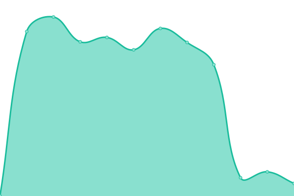
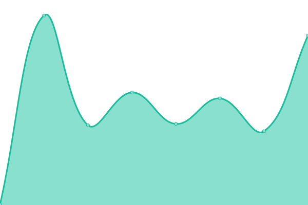
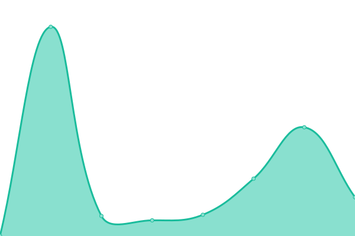

# [📈 Live Status](https://malang-dev.github.io/upptime): <!--live status--> **🟩 All systems operational**

This repository contains the open-source uptime monitor and status page for [Malang.dev](https://malang.dev), powered by [Upptime](https://github.com/upptime/upptime).

With [Upptime](https://upptime.js.org), you can get your own unlimited and free uptime monitor and status page, powered entirely by a GitHub repository. We use [Issues](https://github.com/malang-dev/upptime/issues) as incident reports, [Actions](https://github.com/malang-dev/upptime/actions) as uptime monitors, and [Pages](https://malang-dev.github.io/upptime) for the status page.

<!--start: status pages-->
<!-- This summary is generated by Upptime (https://github.com/upptime/upptime) -->
<!-- Do not edit this manually, your changes will be overwritten -->
<!-- prettier-ignore -->
| URL | Status | History | Response Time | Uptime |
| --- | ------ | ------- | ------------- | ------ |
|  [Malang.dev](https://malang.agency) | 🟩 Up | [malang-dev.yml](https://github.com/malang-dev/upptime/commits/HEAD/history/malang-dev.yml) | 

 150ms
     
 | 

<a href="https://status.malang.dev/history/malang-dev">100.00%</a>
    

|  New Jersey - hosteroid.uk | 🟩 Up | [new-jersey-hosteroid-uk.yml](https://github.com/malang-dev/upptime/commits/HEAD/history/new-jersey-hosteroid-uk.yml) | 

 235ms
     
 | 

<a href="https://status.malang.dev/history/new-jersey-hosteroid-uk">100.00%</a>
    

|  Malang - cloudflare | 🟩 Up | [malang-cloudflare.yml](https://github.com/malang-dev/upptime/commits/HEAD/history/malang-cloudflare.yml) | 

 896ms
     
 | 

<a href="https://status.malang.dev/history/malang-cloudflare">98.30%</a>
    

|  Passbolt | 🟩 Up | [passbolt.yml](https://github.com/malang-dev/upptime/commits/HEAD/history/passbolt.yml) | 

 1017ms
     
 | 

<a href="https://status.malang.dev/history/passbolt">98.30%</a>
    

|  Roundcube | 🟩 Up | [roundcube.yml](https://github.com/malang-dev/upptime/commits/HEAD/history/roundcube.yml) | 

 250ms
     
 | 

<a href="https://status.malang.dev/history/roundcube">100.00%</a>
    

|  [Blog Wordpress](https://blog.malang.agency) | 🟩 Up | [blog-wordpress.yml](https://github.com/malang-dev/upptime/commits/HEAD/history/blog-wordpress.yml) | 

 207ms
     
 | 

<a href="https://status.malang.dev/history/blog-wordpress">100.00%</a>
    

<!--end: status pages-->

[**Visit our status website →**](https://malang-dev.github.io/upptime)

## 📄 License

- Powered by: [Upptime](https://github.com/upptime/upptime)
- Code: [MIT](./LICENSE) © [Anand Chowdhary](https://anandchowdhary.com), supported by [Pabio](https://pabio.com)
- Data in the `./history` directory: [Open Database License](https://opendatacommons.org/licenses/odbl/1-0/)
